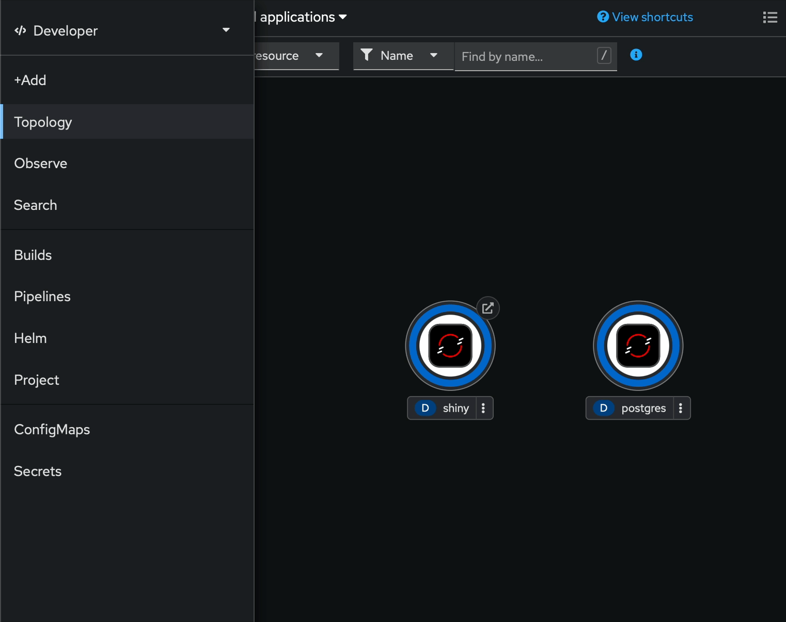

# okd-web-console-command-palette
Userscript to quickly navigate to different OKD web console pages within a namespace using a command palette (and other commands)

Tested on MacOS with Safari

### Keyboard shortcut overview

- `ctrl + k` - Reveal command palette
- `ctrl + t` - Go to visual topology view
- `ctrl + o` - Open 'Copy login command' page
